## Introducción

Hace poco descubrí la página de la Superintendecia de Electricidad y Combustibles (SEC). Me llamó la atención en particular su sección de métricas e información de los cortes de luz a nivel nacional, debido a que noté que hay un gran margen de mejora en su accesibilidad y visualización de los datos para el usuario.


## ¿Qué haremos?

1.  **Preparar nuestro entorno**: primero, instalaremos las dependencias necesarias para el proyecto.

2.  **Extracción de los datos**: aprenderemos a realizar web scraping con Playwright.

3.  **Transformación de los datos**: necesitaremos limpiar y procesar los datos extraídos con Pandas.

4.  **Visualización de los datos**: finalmente, visualizaremos los datos en Powerbi.


Como señala el flujo, empezamos por la Api de la SEC a través de python, luego pasamos a powerbi para terminar las trasnformación y la posterior visualización

## Aclaración 🔴

Si bien creamos una base histórica, esta es parte de otro proyecto independiente, donde tendremos un enfoque diferente con visualizaciones propias. Mantuve el flujo original ya que igualmente lo utilizaremos para una medida, además que nos irá acumulando los datos desde el momento que empezamos la iteración. De todas maneras, si deseas no utilizar esta base, basta con eliminar la parte del código donde la creamos.

## Entorno de Desarrollo

Para este proyecto, necesitaremos instalar las siguientes dependencias: Playwright, Pandas y Powerbi.

Les recomiendo crear un entorno virtual para instalar las dependencias. Para ello, decidan un directorio donde quieran crear el entorno virtual y ejecuten el siguiente comando en la terminal:

``` python

    python -m venv "nombre-del-entorno"-env


```

Una vez creado el entorno virtual, actívenlo con el siguiente comando:

``` bash

    source "nombre-del-entorno"-env/bin/activate


```

Ahora, instalemos las dependencias necesarias:

``` bash

    pip install playwright pandas
    
```

## Extracción de los Datos

Primero, necesitamos importar las librerías necesarias:

``` python

    from playwright.sync_api import sync_playwright
    import pandas as pd
```

# 🚀 Instalar Dependencias

Con el entorno virtual activado, instalemos las librerías necesarias:

``` bash

    pip install playwright pandas
    
```

Además, debemos instalar los navegadores de Playwright:

``` bash

    playwright install

```

------------------------------------------------------------------------

## 🔍 Extracción de Datos con Playwright

Usaremos **Playwright** para interceptar las respuestas de la API de la SEC.

### 📌 Importación de Librerías

``` python
from playwright.sync_api import sync_playwright
import pandas as pd
import os
import time
import re
from datetime import datetime, timedelta
```

------------------------------------------------------------------------

## 📂 Definición de Archivos de Salida

Guardaremos los datos en dos archivos CSV:

-   **`clientes_afectados_tiempo_real.csv`**: Contiene los datos más recientes.
-   **`clientes_afectados_historico.csv`**: Mantiene un registro histórico.

``` python
csv_tiempo_real = "clientes_afectados_tiempo_real.csv"
csv_historico = "clientes_afectados_historico.csv"
```

------------------------------------------------------------------------

# 🔎 Análisis de la Función `intercept_responses()`

Esta función usa **Playwright** para interceptar las respuestas de la API de la **Superintendencia de Electricidad y Combustibles de Chile (SEC)** y extraer información sobre cortes de luz. Luego, almacena estos datos en archivos CSV.

------------------------------------------------------------------------

## 📌 **Estructura General**

1.  **Abrir un navegador en modo headless** (sin interfaz gráfica).
2.  **Interceptar las respuestas de la API** en la página de la SEC.
3.  **Extraer información clave** de los datos JSON recibidos.
4.  **Procesar los datos** para calcular tiempos y crear identificadores únicos.
5.  **Guardar la información en archivos CSV**.
6.  **Cerrar el navegador** una vez completado el proceso.


------------------------------------------------------------------------

## 🛠 **Paso a Paso de la Función**

### 1️⃣ **Inicializar Playwright y Abrir el Navegador**

Se utiliza `sync_playwright()` para iniciar Playwright y lanzar un navegador **Chromium** en modo **headless** (sin interfaz gráfica).

``` python
with sync_playwright() as p:
    browser = p.chromium.launch(headless=True)  # Lanzar navegador en modo headless
    page = browser.new_page()
```

📌 **¿Qué hace esto?**

-   Crea una instancia de Playwright.
-   Lanza un navegador Chromium sin interfaz visual.
-   Crea una nueva página en ese navegador.

------------------------------------------------------------------------

### 2️⃣ **Definir una Lista para Almacenar Registros**

``` python
registros = []  # Lista para almacenar datos nuevos
```

📌 **¿Para qué sirve?**

-   Aquí se guardarán los datos extraídos de la API antes de escribirlos en los archivos CSV.

------------------------------------------------------------------------

### 3️⃣ **Interceptar las Respuestas de la API**

``` python
def handle_response(response):
    if "GetPorFecha" in response.url:
        try:
            data = response.json()
            timestamp_actual = datetime.now()  # Tiempo de consulta
```

📌 **¿Qué hace esto?**

-   **Verifica si la URL de la respuesta contiene `"GetPorFecha"`**, lo que indica que es una respuesta de la API relevante.
-   **Convierte la respuesta en JSON** (`response.json()`).
-   **Guarda el timestamp actual** para identificar cuándo se hizo la consulta.

------------------------------------------------------------------------

### 4️⃣ **Procesar los Datos Extraídos**

``` python
for entry in data:
    actualizado_hace = entry.get("ACTUALIZADO_HACE", "")
    minutos_atras = 0

    match = re.search(r'(\d+)\s+Minutos', actualizado_hace)
    if match:
        minutos_atras = int(match.group(1))  # Extrae el número antes de "Minutos"

    hora_exacta_reporte = timestamp_actual - timedelta(minutes=minutos_atras)
```

📌 **¿Qué hace esto?**

-   **Extrae el campo `"ACTUALIZADO_HACE"`**, que indica hace cuánto tiempo se actualizó la información.
-   **Usa una expresión regular (`re.search`) para extraer los minutos** mencionados en `"ACTUALIZADO_HACE"`.
-   **Calcula la hora exacta del reporte**, restando esos minutos del timestamp actual.

------------------------------------------------------------------------

### 5️⃣ **Crear un Identificador Único para Cada Registro**

``` python
unique_id = f"{entry.get('FECHA_INT_STR', '')}-{entry.get('REGION', '')}-{entry.get('COMUNA', '')}-{entry.get('EMPRESA', '')}-{entry.get('CLIENTES_AFECTADOS', 0)}-{hora_exacta_reporte.strftime('%Y-%m-%d %H:%M:%S')}"
```

📌 **¿Por qué es importante esto?**

-   **Evita la duplicación de datos**, asegurando que cada registro tenga un ID único.
-   **Facilita la organización** en los archivos CSV.

------------------------------------------------------------------------

### 6️⃣ **Guardar los Datos en la Lista `registros`**

``` python
registros.append({
    "ID_UNICO": unique_id,
    "TIMESTAMP": timestamp_actual.strftime("%Y-%m-%d %H:%M:%S"),
    "HORA_EXACTA_REPORTE": hora_exacta_reporte.strftime("%Y-%m-%d %H:%M:%S"),
    "FECHA": entry.get("FECHA_INT_STR", ""),
    "REGION": entry.get("NOMBRE_REGION", ""),
    "COMUNA": entry.get("NOMBRE_COMUNA", ""),
    "EMPRESA": entry.get("NOMBRE_EMPRESA", ""),
    "CLIENTES_AFECTADOS": entry.get("CLIENTES_AFECTADOS", 0),
    "ACTUALIZADO_HACE": actualizado_hace
})
```

📌 **¿Qué hace esto?**

-   **Guarda cada registro como un diccionario** dentro de la lista `registros`.
-   **Almacena los datos clave** como fecha, región, comuna, empresa y clientes afectados.

------------------------------------------------------------------------

### 7️⃣ **Capturar las Respuestas de la API**

``` python
page.on("response", handle_response)
```

📌 **¿Qué hace esto?**

-   **Asocia la función `handle_response` con cada respuesta de la página**.
-   **Intercepta las respuestas en segundo plano** mientras se carga la web.

------------------------------------------------------------------------

### 8️⃣ **Acceder a la Página de la SEC**

``` python
page.goto("https://apps.sec.cl/INTONLINEv1/index.aspx")
page.wait_for_timeout(5000)  # Espera para capturar datos
```

📌 **¿Qué hace esto?**

-   **Abre la página de la SEC en el navegador**.
-   **Espera 5 segundos** para permitir la carga de datos.

------------------------------------------------------------------------

### 9️⃣ **Cerrar el Navegador**

``` python
browser.close()
```

📌 **¿Por qué es importante?**

-   **Libera recursos del sistema**.
-   **Evita que el script consuma demasiada memoria**.

------------------------------------------------------------------------

## 📊 **Guardado de Datos en CSV**

``` python
if registros:
    df_new = pd.DataFrame(registros)

    # 📌 Guardar en CSV histórico
    if os.path.exists(csv_historico):
        df_historico = pd.read_csv(csv_historico, encoding="utf-8-sig")
        df_historico = pd.concat([df_historico, df_new]).drop_duplicates(subset=["ID_UNICO"], keep="first")
    else:
        df_historico = df_new

    df_historico.to_csv(csv_historico, index=False, encoding="utf-8-sig")

    # 📌 Guardar en CSV de Tiempo Real
    df_new.to_csv(csv_tiempo_real, index=False, encoding="utf-8-sig")

    print(f"✅ Datos guardados en:\n📌 {csv_historico} (Histórico)\n📌 {csv_tiempo_real} (Tiempo Real)")
```

📌 **¿Qué hace esto?**

-   **Convierte los registros en un DataFrame de Pandas**.
-   **Guarda los datos en CSV histórico y de tiempo real**.
-   **Evita duplicados basándose en el ID único**.

------------------------------------------------------------------------

## 🔁 **Automatización Cada 5 Minutos**

``` python
while True:
    intercept_responses()
    print("⏳ Esperando 5 minutos para la siguiente ejecución...\n")
    time.sleep(5 * 60)  # 5 minutos en segundos
```

📌 **¿Qué hace esto?**

-   **Ejecuta `intercept_responses()` en un bucle infinito**.
-   **Espera 5 minutos (`time.sleep(5 * 60)`) antes de volver a ejecutar la función**.

Puedes elegir el tiempo que desees, yo decidí 5 minutos. 

## Extra

Esta es una manera de automatizar, no obstante, también puedes utilizar el programador de tareas en Windows y ejecutar un .bat que contenga la ejecución del .py. Si lo ejecutas, no es necesario mantener el código de loop de arriba, ya que el programador lo puedes configurar con intervalos de tiempo.


```bash
@echo off
cd C:\Users\SIMON\Desktop\Kaggle\luz
python end.py
exit

```


### Felicidades⭐!
Ya tenemos nuestra base de datos casi lista para su visualización. Si bien podríamos terminar de darle formato a los datos directamente con pandas, es una perfecta ocasión para hacerlo en powerbi, ya que podremos visualizar con facilidad los cambios que iremos realizando para construir nuestro dashboard interactivo. 

### Aclaración 🔴
Este no es un tutorial de cómo utilizar PowerBI, por lo que es necesario saber lo básico para poder seguir el tutorial: instalación, configuración, comandos, etc. 

#  Powerbi: transformación y Visualización de los datos 
Dependiendo de la carpeta donde hayamos realizado nuestro proyecto, podremos encontrar el archivo resultante, el cual utilizaremos ahora.

Para poder manipular nuestros datos en Powerbi hay que seguir estos sencillos pasos:

- **Abrir PowerBI**


- **Click en Get data from other sources**

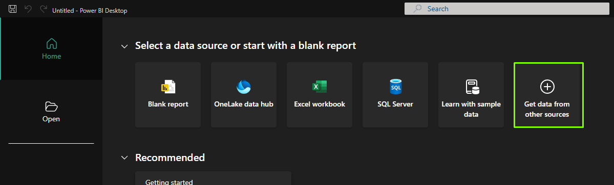


- **Seleccionamos Text/CSV**

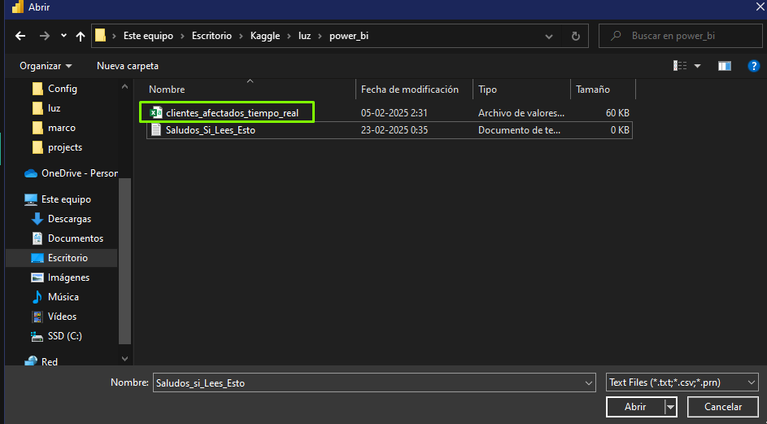


- **Buscamos nuestro archivo .csv**


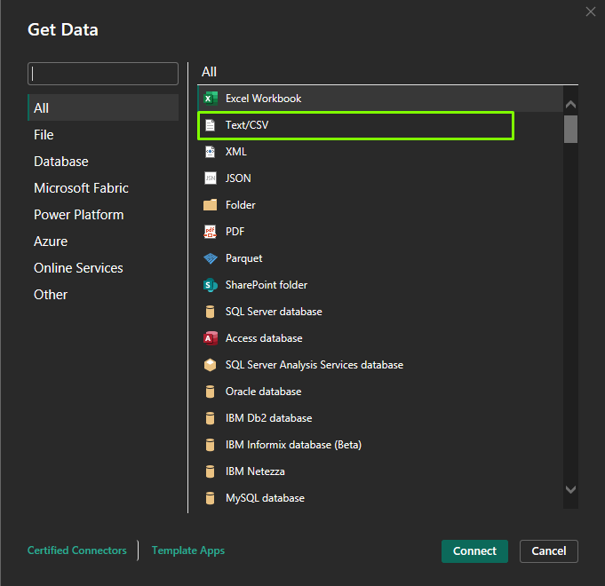


- **Click en Load**

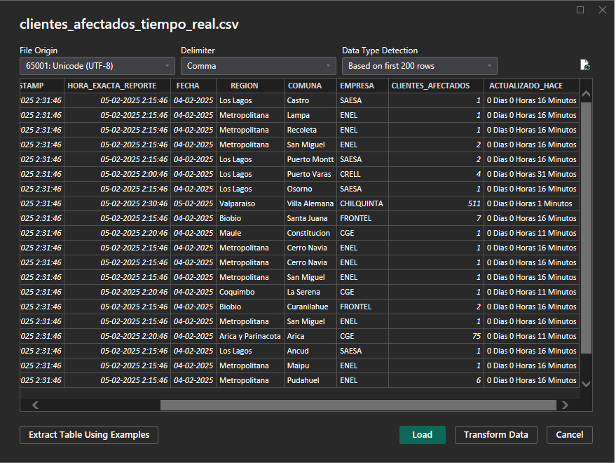

A continuación explicaré  paso a paso el código M que utilizamos para transformar datos en Power Query. Este script carga nuestro archivo CSV, promociona los encabezados, cambia los tipos de datos, agrega una columna personalizada concatenando un texto fijo con el valor existente en la columna **REGION**, y aplica una serie de reemplazos para corregir los nombres de las regiones de forma automatizada.


- **En la sección Home click en Advanced Editor**

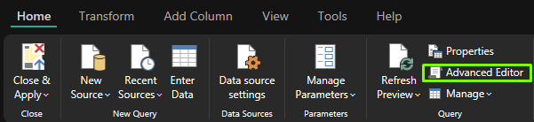

- **Copia y pega el código de más abajo**

- **Click en Done**

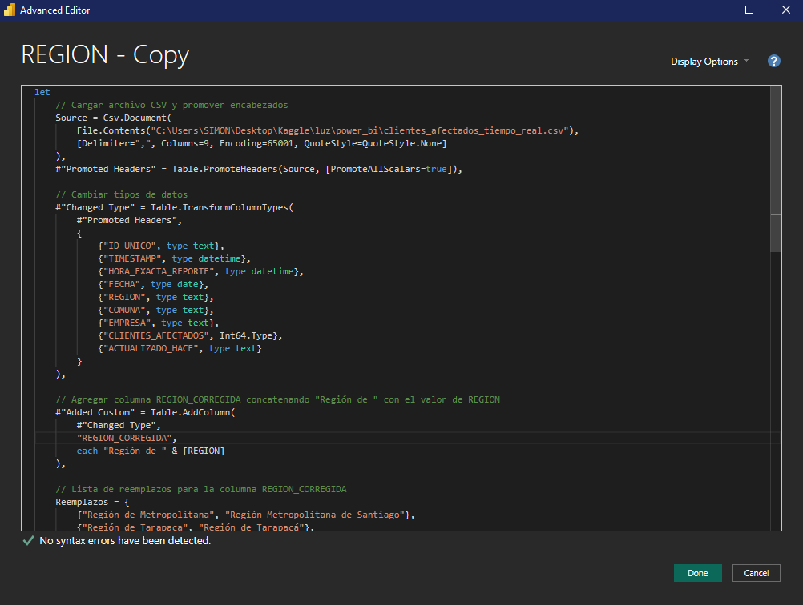

# Código M

```m
let
    // Cargar archivo CSV y promover encabezados
    Source = Csv.Document(
        File.Contents("C:\Users\SIMON\Desktop\Kaggle\luz\power_bi\clientes_afectados_tiempo_real.csv"),
        [Delimiter=",", Columns=9, Encoding=65001, QuoteStyle=QuoteStyle.None]
    ),
    #"Promoted Headers" = Table.PromoteHeaders(Source, [PromoteAllScalars=true]),
    
    // Cambiar tipos de datos
    #"Changed Type" = Table.TransformColumnTypes(
        #"Promoted Headers",
        {
            {"ID_UNICO", type text}, 
            {"TIMESTAMP", type datetime}, 
            {"HORA_EXACTA_REPORTE", type datetime}, 
            {"FECHA", type date}, 
            {"REGION", type text}, 
            {"COMUNA", type text}, 
            {"EMPRESA", type text}, 
            {"CLIENTES_AFECTADOS", Int64.Type}, 
            {"ACTUALIZADO_HACE", type text}
        }
    ),
    
    // Agregar columna REGION_CORREGIDA concatenando "Región de " con el valor de REGION
    #"Added Custom" = Table.AddColumn(
        #"Changed Type",
        "REGION_CORREGIDA",
        each "Región de " & [REGION]
    ),
    
    // Lista de reemplazos para la columna REGION_CORREGIDA
    Reemplazos = {
        {"Región de Metropolitana", "Región Metropolitana de Santiago"},
        {"Región de Tarapaca", "Región de Tarapacá"},
        {"Región de Magallanes", "Región de Magallanes y Antártica Chilena"},
        {"Región de Aysén", "Región de Aysén del Gral.Ibañez del Campo"},
        {"Región de O`Higgins", "Región del Libertador Bernardo O'Higgins"},
        {"Región de Biobio", "Región del Bío-Bío"},
        {"Región de La Araucania", "Región de La Araucanía"},
        {"Región de Los Rios", "Región de los Ríos"},
        {"Región de Valparaiso", "Región de Valparaíso"},
        {"Región de Maule", "Región del Maule"}
    },

    // Aplicar reemplazos a REGION_CORREGIDA de forma acumulativa
    Resultado = List.Accumulate(
        Reemplazos,
        #"Added Custom",
        (tabla, par) => Table.ReplaceValue(
            tabla,
            par{0},
            par{1},
            Replacer.ReplaceText,
            {"REGION_CORREGIDA"}
        )
    )
in
    Resultado
```


## Explicación del código M 


A continuación, desglosamos cada parte del código para comprender su funcionamiento.


---

## 📌 Cargar el Archivo CSV y Promover Encabezados

```m
Source = Csv.Document(
    File.Contents("C:\Users\SIMON\Desktop\Kaggle\luz\power_bi\clientes_afectados_tiempo_real.csv"),
    [Delimiter=",", Columns=9, Encoding=65001, QuoteStyle=QuoteStyle.None]
),
#"Promoted Headers" = Table.PromoteHeaders(Source, [PromoteAllScalars=true])
```

**¿Qué hace esto?**

- **Csv.Document & File.Contents:** Carga el archivo CSV desde la ruta especificada.
- **Table.PromoteHeaders:** Convierte la primera fila en los nombres de columna, facilitando la manipulación posterior.

---

## 📌 Cambiar Tipos de Datos

```m
#"Changed Type" = Table.TransformColumnTypes(
    #"Promoted Headers",
    {
        {"ID_UNICO", type text}, 
        {"TIMESTAMP", type datetime}, 
        {"HORA_EXACTA_REPORTE", type datetime}, 
        {"FECHA", type date}, 
        {"REGION", type text}, 
        {"COMUNA", type text}, 
        {"EMPRESA", type text}, 
        {"CLIENTES_AFECTADOS", Int64.Type}, 
        {"ACTUALIZADO_HACE", type text}
    }
)
```

**¿Qué hace esto?**

- Se establecen los tipos de datos adecuados para cada columna, lo que es crucial para evitar errores y asegurar que los cálculos o transformaciones posteriores se realicen correctamente.

---

## 📌 Agregar una Columna Personalizada

```m
#"Added Custom" = Table.AddColumn(
    #"Changed Type",
    "REGION_CORREGIDA",
    each "Región de " & [REGION]
)
```

**¿Qué hace esto?**

- **Table.AddColumn:** Agrega una nueva columna a la tabla.
- **"REGION_CORREGIDA":** Es el nombre de la nueva columna.
- **each "Región de " & [REGION]:** Para cada fila, concatena el texto fijo `"Región de "` con el valor existente en la columna **REGION**.

*Ejemplo:*  
Si el valor en **REGION** es `"Metropolitana"`, el resultado en **REGION_CORREGIDA** será `"Región de Metropolitana"`.

---

## 📌 Aplicar Reemplazos de Forma Acumulativa

### Definición de la Lista de Reemplazos

```m
Reemplazos = {
    {"Región de Metropolitana", "Región Metropolitana de Santiago"},
    {"Región de Tarapaca", "Región de Tarapacá"},
    {"Región de Magallanes", "Región de Magallanes y Antártica Chilena"},
    {"Región de Aysén", "Región de Aysén del Gral.Ibañez del Campo"},
    {"Región de O`Higgins", "Región del Libertador Bernardo O'Higgins"},
    {"Región de Biobio", "Región del Bío-Bío"},
    {"Región de La Araucania", "Región de La Araucanía"},
    {"Región de Los Rios", "Región de los Ríos"},
    {"Región de Valparaiso", "Región de Valparaíso"},
    {"Región de Maule", "Región del Maule"}
}
```

**¿Qué hace esto?**

- Se define una lista de pares, donde cada par contiene:
  - **Texto original:** Valor que aparece en la columna **REGION_CORREGIDA**.
  - **Texto corregido:** Valor con el que se reemplazará el texto original.

### Aplicación de los Reemplazos con List.Accumulate

```m
Resultado = List.Accumulate(
    Reemplazos,
    #"Added Custom",
    (tabla, par) => Table.ReplaceValue(
        tabla,
        par{0},
        par{1},
        Replacer.ReplaceText,
        {"REGION_CORREGIDA"}
    )
)
```

**¿Qué hace esto?**

- **List.Accumulate:** Itera sobre cada par de la lista **Reemplazos**.
- **#"Added Custom":** Es el paso inicial que contiene la tabla con la nueva columna **REGION_CORREGIDA**.
- **Table.ReplaceValue:** En cada iteración, reemplaza el valor **par{0}** (texto original) por **par{1}** (texto corregido) en la columna **REGION_CORREGIDA**.
- El proceso es acumulativo: cada reemplazo se aplica sobre el resultado del reemplazo anterior.

---


## Construcción de métricas, el mapa interactivo, filtro y gráficos


En PowerBi utilizamos una herramienta llamada medida, con esta podemos realizar cálculos utilizando la sintaxis adecuada, lo que permite construir métricas a partir de nuestros datos

### Última Actualización

```m

Última Actualización = MAX('clientes_afectados_historico'[TIMESTAMP])   

```

Con esta medida podremos construir una *card* con la hora actual que corresponde la información. Esta por defecto incluye fechas, vamos a corregirlo:

- **Click en *Format Visual* en el menú de la derecha**
- **General**
- ***Data Format***
- **en *Format option* buscaremos el formato *long Time***

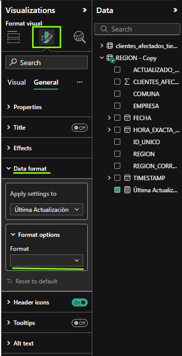

### Total de Hogares sin Luz

Es una buena práctica crear las medidas explícitamente, es decir, introducir el código de lo que queremos que haga nuestra medida. Para efectos prácticos, utilizaremos la medida implícita de sumatoria que nos ofrece PowerBi:

- **Seleccionamos una *card* y arrastramos CLIENTES_AFECTADOS a *field***

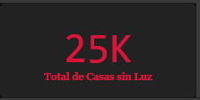

### Comparación última medición

```m
Comparación última medición = 
VAR ultimoTiempo = MAX(clientes_afectados_tiempo_real[TIMESTAMP])
VAR PenultimoTiempo = 
    CALCULATE(MAX(clientes_afectados_tiempo_real[TIMESTAMP]), 
              clientes_afectados_tiempo_real[TIMESTAMP] < ultimoTiempo)

VAR Afectados_Ultima =
    CALCULATE(SUM(clientes_afectados_tiempo_real[CLIENTES_AFECTADOS]), 
              clientes_afectados_tiempo_real[TIMESTAMP] = ultimoTiempo)

VAR Afectados_Anterior =
    CALCULATE(SUM(clientes_afectados_tiempo_real[CLIENTES_AFECTADOS]), 
              clientes_afectados_tiempo_real[TIMESTAMP] = PenultimoTiempo)

RETURN
    Afectados_Ultima - Afectados_Anterior

```

Básicamente esta medida crea 4 variables: 

- **ultimoTiempo -> el tiempo más reciente**
- **PenultimoTiempo -> medición pasada**
- **Afectados_Ultima -> total de hogares afectados más reciente**
- **Afectados_Anterior -> total de hogares afectados de la medición anterior**

A través de estas podemos obtener la variación nominal de los hogares afectados respecto a la medición anterior


### Porcentaje hogares sin luz

Con esta métrica podremos dimensionar la cantidad de hogares sin suministro eléctrico a nivel nacional. El total de hogares fue un dato que recogí del  [sitio web oficial](link)

```m
Porcentaje_Hogares_Sin_Luz = 
VAR Total_Hogares = 6534588
VAR Total_Afectados = SUM(clientes_afectados_tiempo_real[Clientes_Afectados])
RETURN 
    DIVIDE(Total_Afectados, Total_Hogares, 0)

```

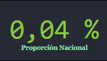

### Mapa Interactivo

Visitando mi [repositorio](link) puedes descargar el archivo .topojson necesario para visualizar el mapa de Chile. Una vez descargado, necesitamos habilitar la opción de mapas de forma (Shape Map) en nuestro Powerbi:

 -**En la esquina inferior izquierda de la sección File click en Options and settings y luego Options**
 -**Click en Preview Features y activamos el shape map visual**

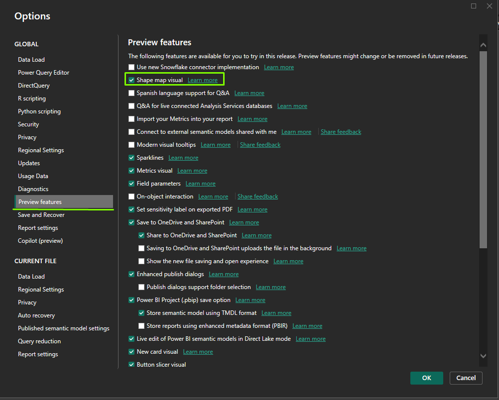


Una vez activado lo introducimos con la interfaz gráfica seleccionando **Shape map** e introducimos como **Location** nuestra columna **REGION_CORREGIDA** que creamos antes y en **Color saturation** la sumatoria de los clientes afectados. 

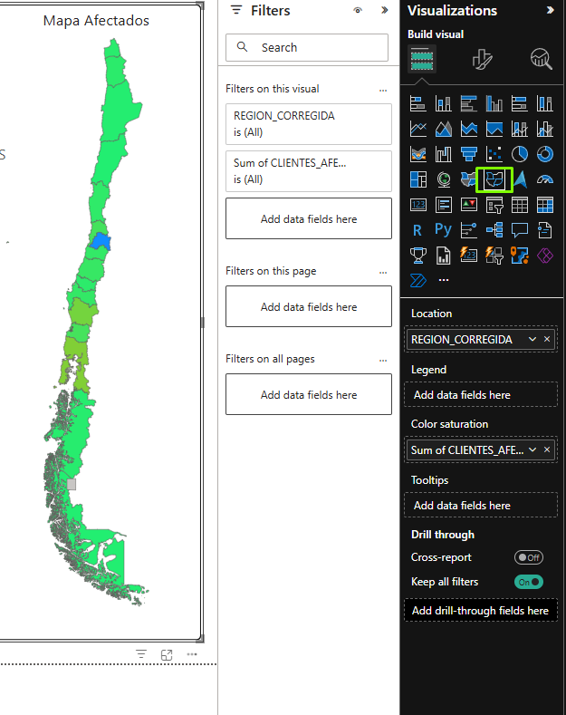

Nos dirigimos a la pestaña **visual** del mapa y en **map type** seleccionamos **Custom map** y en **Add a map type** agregamos nuestro archivo json

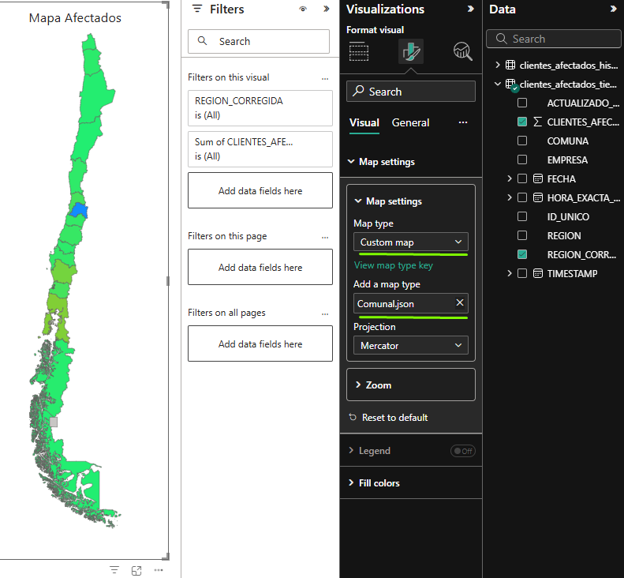

### Top 3 Comunas

Ya sabes cómo agregar una medida, por lo que te proporciono el código para obtener una tarjeta que nos informe en top 3 actual de las comunas con mayor cantidad de hogares afectados. 


```m
TOP3_Comunas = 
VAR ComunasFiltradas =
    FILTER(
        ALL(clientes_afectados_tiempo_real), 
        clientes_afectados_tiempo_real[Region_Corregida] IN VALUES(clientes_afectados_tiempo_real[Region_Corregida])
    )

VAR ComunasGrouped =
    SUMMARIZE(
        ComunasFiltradas, 
        clientes_afectados_tiempo_real[Comuna],
        "@Clientes_Afectados", SUM(clientes_afectados_tiempo_real[Clientes_Afectados])
    )

VAR ComunasRanked =
    TOPN(3, ComunasGrouped, [@Clientes_Afectados], DESC)

RETURN
    CONCATENATEX(ComunasRanked, clientes_afectados_tiempo_real[Comuna], ", ")


```


### Hogares sin Luz por Región

Este gráfico se crea con una visual de *Stacked bar chart*. Utilicé en el eje y las Comunas, en el X la sumatoria de clientes afectados y la leyenda son las empresas eléctricas

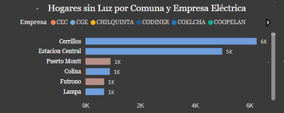

### Hogares sin luz por Región

Es una visualización tipo *#Clustered bar chart#* similar al anterior con la diferencia que ahora es por Regiones y sin leyenda

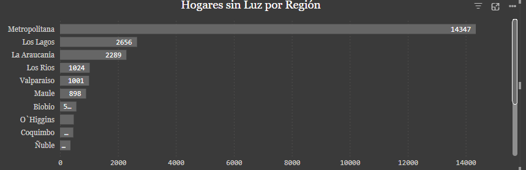

### Filtro por Región

Esta es una elección mía, podrías hacer filtros por comunas si deseas, incluso provincias si creas la columna. Lo utilicé con la interfaz gráfica, en la opción Filtro y en *field* las regiones, no la corregida, ya que son muy largos los nombres.

### Listo!

Felicidades, si llegaste hasta acá tienes un dashboard en condiciones, ¿cierto? Pues no necesariamente. Es funcional, pero requiere de un estilado personalizado para verse más atráctivo y que llame la atención. Decidí no hacer un tutorial de esto ya que mi enfoque principal no es hacer un tutorial a fondo de PowerBI. De hecho, no hice grandes cambios, simplemente estandaricé las fuentes, tamaños, colores, títulos y poco más. Te puedo señalar que es muy importante que hayan buenos contrastes, que las letras sean legibles y que no hayan tantos colores: menos es más. De todas maneras, podrás utilizar mi proyecto como plantilla para estilarlo a tu manera. 

# Conclusiones

A lo largo del tutorial hemos podido ahondar desde la extraccion de los datos con python, a la transformación y visualización de estos con powerbi. Me gustaría señalar algunos aspectos a considerar del proyecto: 

- **Playwright + pandas:** combinación poderosa para extraer los datos y procesarlos, un factor clave para una correcta visualización


- **Powerbi:** es una herramienta capaz de construir dashboards impactantes con un par de clicks y un poco de código, lo que es un aspecto positivo para mi experiencia considerando que es mi primera vez usándolo**


- **Powerbi es un software de pago:** la capa gratuita muchas veces nos limita la personalización, escalabilidad del proyecto y procesos de automatización, esto me hizo frenar más ideas que tenía en mente para este proyecto, ya que requerían de una licencia pagada, sin embargo, no niego que siga realizando proyectos con Powerbi debido a su facilidad y versatilidad, de hecho mi siguiente proyecto es utilizando powerbi + postgresql, así que les invito a estar atentos


- **Dependo de que el SEC funcione:** si se corta la luz y la página está caída, no podremos monitorear los casos, un aspecto que lamentablemente no puedo solucionar

- **Base de datos histórica:** si te fijas bien, hemos creado dos bases pero sólo nos hemos quedado con la de tiempo real. Bueno, esto se debe en parte a lo mencionado más arriba sobre los costes, sumado a que si bien son datos parecidos, el enfoque cambia bastante, ya que buscamos patrones en el tiempo y utilizamos otras métricas para poder realizar el análisis, por lo que decidí profundizarlo de manera independiente a este proyecto. Aún así, la utilizamos en la medida para comparar respecto a la medición pasada

- **Futuro del proyecto:** me entusiasma la idea de poder automatizar un sistema de reporte periódico (horas, minutos, días , mensuales, etc.) y poder ayudar a la gente a que podamos analizar los contenidos que ya nos presenta la SEC pero con un enfoque más didáctico y aterrizado para los usuarios. Es una tarea pendiente que dejo la puerta abierta a las posibilidades**

- **Python para todo:** he pensado que si hago todo esto utilizando python, podríamos escalarlo gratuitamente. También es una idea que tengo pensada a futuro y que puede beneficiar en mayor medida a las personas

Gracias por llegar hasta aquí, cualquier feedback siempre es bienvenido 💜

